# 📱 MeetzMe - Geolocalização em Tempo Real

>"A questão não é ‘o que queremos saber sobre as pessoas’. A questão é ‘o que as pessoas querem dizer sobre elas mesmas." - Mark Zuckerberg

O MeetzMe é um aplicativo desenvolvido em React Native como Trabalho de Conclusão de Curso do Técnico Informática da Etec de Hortolândia. O projeto foi iniciado em Janeiro de 2019.

## O que é?

O MeetzMe é uma aplicação, inicialmente para dispositivos Android, que tem como objetivo auxiliar a localização de pessoas e eventos em um determinado meio geográfico. Com o MeetzMe é possível conhecer a localização exata e em tempo real de usuários que aceitaram o convite de um determinado evento.

## Desenvolvimento

A aplicação foi desenvolvida em [React Native](https://facebook.github.io/react-native/), tendo Firebase como BackEnd e Base de Dados. Foi utlizado também NodeJS como parte do Cloud Functions do Firebase para o envio de notificações.

### Nosso Package
Algumas das principais libs utilizadas no projeto:

| Módulo | Utilização |
| ------------- | ------------- |
| [MobX](https://github.com/mobxjs/mobx) | Gerenciamento do store da aplicação  |
| [Moment](https://github.com/moment/moment) | Trabalhar com Data e Hora  |
| [Reactotron](https://github.com/infinitered/reactotron) | Debugger para React Native  |
| [RN Maps](https://github.com/react-native-community/react-native-maps)  | API do Google Maps para React Native  |
| [RN Maps Directions](https://github.com/bramus/react-native-maps-directions) | API de Directions do Google Maps para React Native  |
| [RN Google Places](https://github.com/tolu360/react-native-google-places) | API Places do Google Maps para React Native  |
| [RN Paper](https://github.com/callstack/react-native-paper) | Componentes Material Design  |
| [RN Firebase](https://github.com/invertase/react-native-firebase) | Integração com Firebase para React Native  |
| [React Navigation](https://github.com/react-navigation/react-navigation) | Trabalhar com Navigators, Screens e Tabs com React Native  |
| [RN Vector Icons](https://github.com/oblador/react-native-vector-icons) | Biblioteca de Icones para React Native  |
| [RN Raw Bottom Sheet](https://github.com/gstcarv/react-native-raw-bottom-sheet) | Bottom Sheet para React Native  |
| [RN Image Crop Picker](https://github.com/ivpusic/react-native-image-crop-picker) | Recorte de Imagens  |


## Algumas telas


| Principal | Login | Cadastro |
| :---:          |     :---:      |     :---:  |
|    | 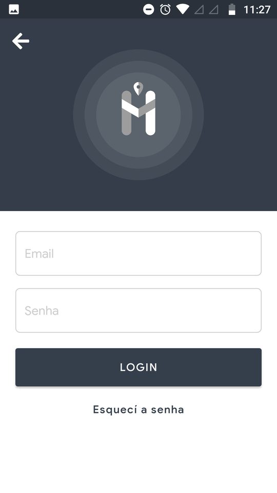     | 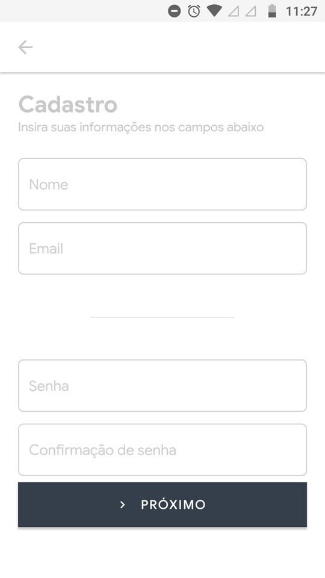    |


| Dashboard | Contatos | Procurar Contatos |
| :---:          |     :---:      |     :---:  |
| 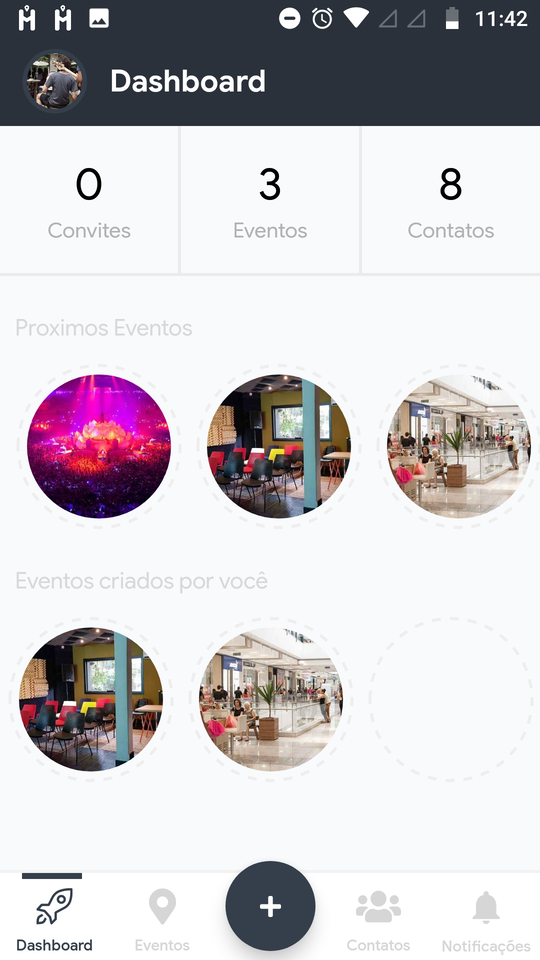   | 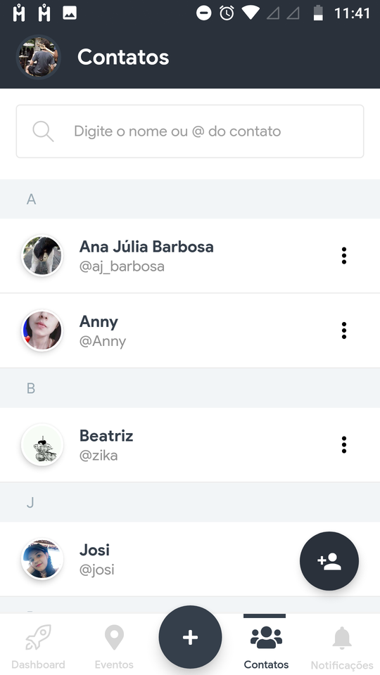     |     |


| Convites Aceitos | Convites Pendentes | Ver Convite |
| :---:          |     :---:      |     :---:  |
| 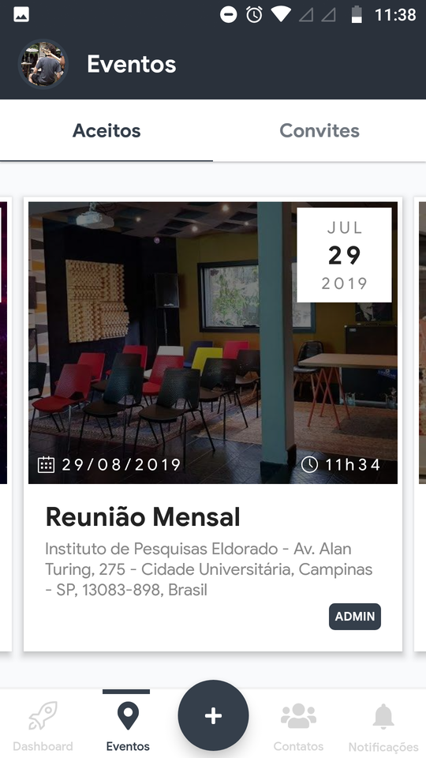   | 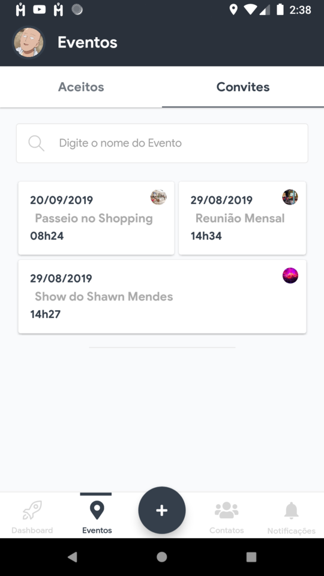     | 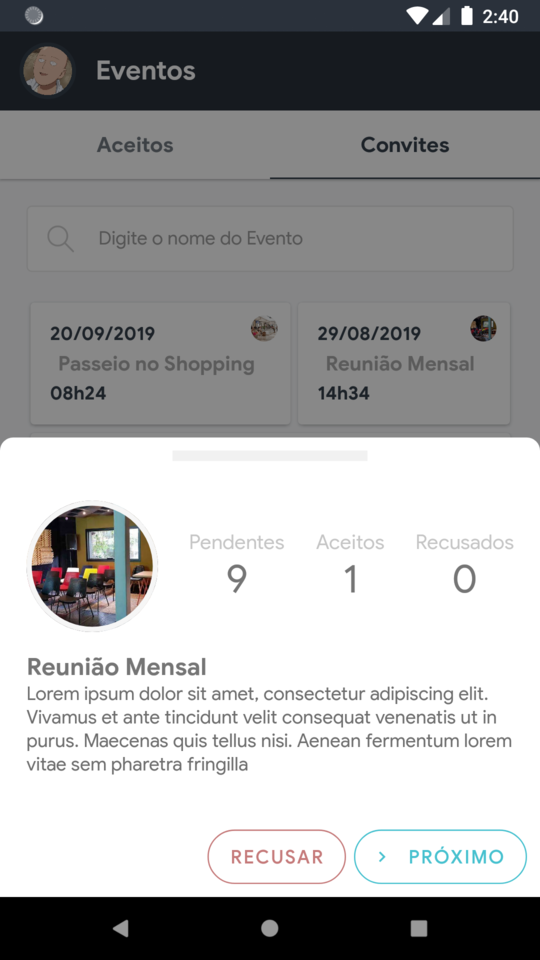    |


| Novo Evento | Selecionar Localização | Convidar Contatos |
| :---:          |     :---:      |     :---:  |
|    | 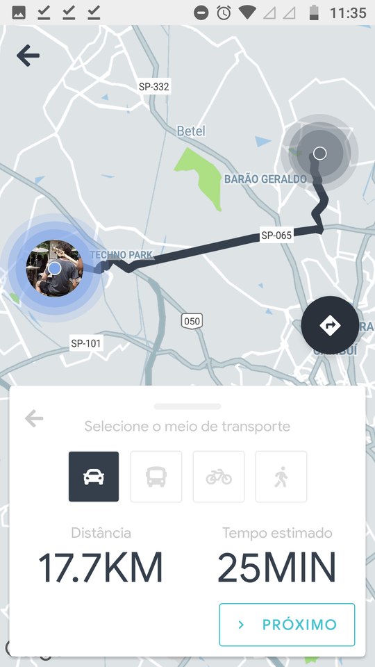     | 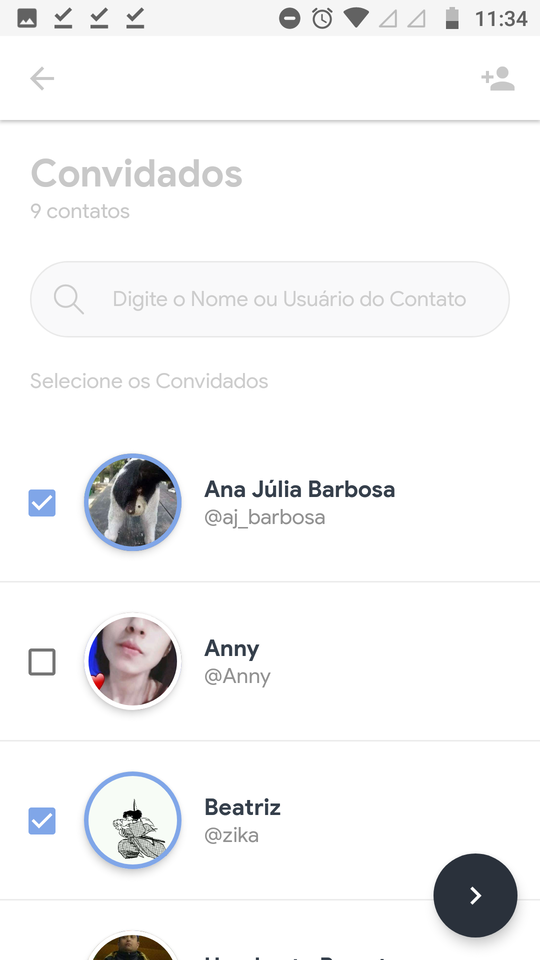    |


| Mapa do Evento | Informações Usuário | Informações Evento |
| :---:          |     :---:      |     :---:  |
| 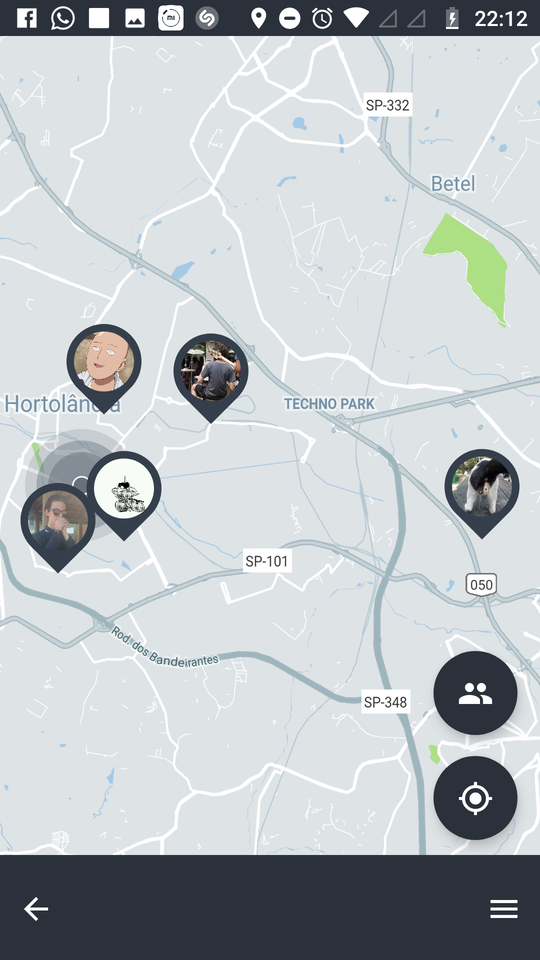   | 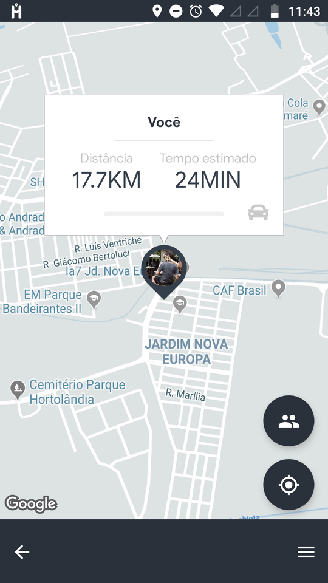     |     |


 <br />

# 🚀 Instalação

__Importante__: Necessária a instalação da [React Native CLI](https://facebook.github.io/react-native/docs/getting-started)

<br />

__Clonar o repositório__

```
git clone https://github.com/gstcarv/meetzme-app
cd meetzme-app
```

<br />

__Instalar as dependências__

```
yarn install
```
ou

```
npm install
```

<br />

__Gerar link das dependências nativas__

```
react-native link
```
<br />

__Converter as Libs para AndroidX__

```
npx jetify
```

<br />

__🔥 Executar o app__

```
react-native run-android
```

<br />

## ☠ Problemas Frequentes

> Android dependency 'androidx.transition:transition' has different version for the compile (1.0.0-rc01) and runtime (1.1.0) classpath. You should manually set the same version via DependencyResolution

Provavelmente você não converteu as libs para AndroidX

```
npx jetify
react-native run-android
```

### Outros erros

Tente:
```
  cd android
  gradlew clean
  cd..
  react-native run-android
```

<br />

# 🎉 Agradecimentos

## Equipe de Testes
- [Tiago Carvalho](https://github.com/tiagocsilva)
- [Humberto Barreto](https://www.linkedin.com/in/humberto-barreto-42204116a/)
- Luis Gustavo Farinelli
- Enrico Gherardi
- Beatriz Lima
- Ana Júlia Barbosa


🌟 Agradecimentos especiais à [Rocketseat](https://github.com/Rocketseat) pelas ótimas aulas e artigos sobre React Native, e à própria [Facebook](https://github.com/facebook) e equipe do React Native por disponibilizarem-nos uma grande tecnologia.